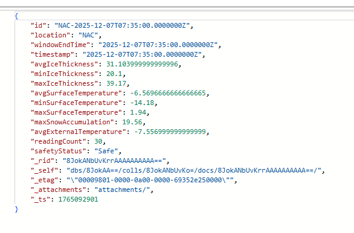

# rideau-canal-sensor-simulation

### 1. Overview

### What the simulator does
This simulator mimics IoT sensors dand we use it to generate synthetic telemetry data for ice and environmental conditions. Each simulated device represents a canal location and sends periodic telemetry to Azure IoT Hub

### Technologies used (Python, Azure IoT SDK)
- Python
- Azure IoT Device
- dotenv
- datetime

### 2. Prerequisites
- Azure subscription
- Python installed locally
- Node.js and npm
- A GitHub account for repository access and deployments

### 3. Installation
Have python isntalled locally

### 4. Configuration
create a .env file with connectrings and secrets based on the .env.example and add it to .gitignore
make sure they all correspond to the devices registered in IoT Hub.

### 5. Usage
You can run the 3 sensors by using this:
python sensor_simulator.py

### 6. Code Structure
Each script connects to Azure IoT Hub using a device connection string loaded from environment variables. It continuously generates randomized telemetry values (ice thickness, temperatures, and snow accumulation) for a specific canal location and sends the data to IoT Hub at a fixed time interval. Sensor_simulation.py is the main script that is responsible to start all 3 scripts.

### Key functions
get_telemetry() – Generates randomized sensor data for a specific location.
main() – Establishes the IoT Hub connection and sends telemetry on a 10 second loop.
main() [sensor_simulation] - Responsible to start all 3 .py scripts

### 7. Sensor Data Format

JSON schema
Example output

Troubleshooting

### 8. Common issues and fixes
Couldn't get all connection strings working in 1 script, so I used 1 script to use all 3 scripts.